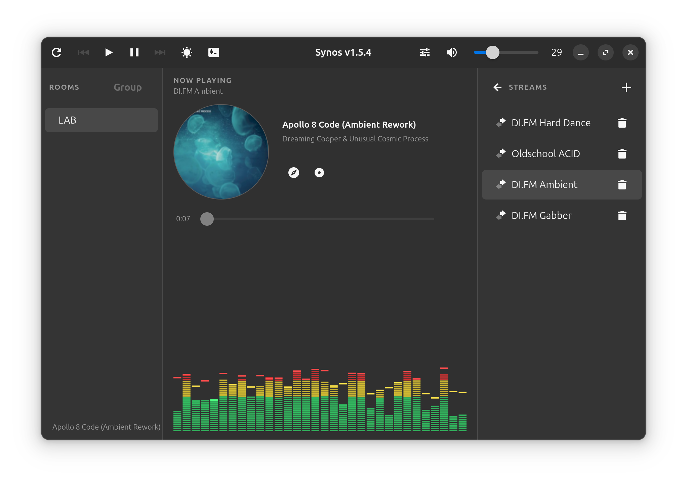

# Synos

A GTK4 + Libadwaita Sonos controller for Linux.



## Features

- **Speaker Discovery** — Automatically finds Sonos speakers on your network
- **Stream Playback** — Play internet radio streams (Icecast, SHOUTcast, etc.)
- **Music Library** — Browse and play local audio files from configurable folders
- **Subfolder Navigation** — Drill into subdirectories with back button support
- **Play Queue** — Play single tracks or entire folders, with prev/next navigation
- **Auto-Advance** — Automatically plays the next track when the current one finishes
- **Seek Slider** — Draggable position slider for local files with duration display
- **Album Art** — Automatic cover art from MusicBrainz/Cover Art Archive with disk cache and smart retry
- **Equalizer** — Bass, treble, and loudness controls per speaker
- **Now Playing** — Live track info with title, artist, and stream name
- **YouTube / Discogs Search** — Search current track on YouTube or Discogs with one click
- **VU Meter** — Animated 32-bar visualizer with peak hold
- **Console Log** — Collapsible log window with timestamped, color-coded entries
- **Light/Dark Mode** — Toggle with persistent preference
- **Transport Controls** — Play, pause, prev, next, volume, mute from the headerbar
- **Non-blocking UI** — All playback and network calls run in background threads
- **Keyboard Shortcuts** — Space (play/pause), F12 (console), Arrow Up/Down (volume)

## Supported Audio Formats

mp3, flac, aac, ogg, wav, wma, m4a, opus

## Requirements

### System packages (Ubuntu/Debian)

```bash
sudo apt install python3-gi python3-gi-cairo gir1.2-gtk-4.0 gir1.2-adw-1
```

### Python packages

```bash
pip install soco
```

## Running

```bash
cd Synos
python3 -m synos
```

## Desktop Launcher

Create `~/.local/share/applications/com.github.synos.desktop`:

```ini
[Desktop Entry]
Name=Synos
Comment=Sonos controller for Linux
Exec=python3 -m synos
Path=/path/to/Synos
Icon=/path/to/Synos/synos.svg
Terminal=false
Type=Application
Categories=AudioVideo;Audio;GTK;
Keywords=sonos;music;speaker;stream;
```

Update `Path=` and `Icon=` to your Synos directory, then run:

```bash
update-desktop-database ~/.local/share/applications/
```

Synos will appear in your application launcher.

## Configuration

All settings are stored in `~/.config/synos/`:

- `streams.json` — Saved internet radio streams
- `library.json` — Music library folder paths
- `preferences.json` — Theme preference (dark/light)
- `artcache/` — Cached album art images

## License

MIT
